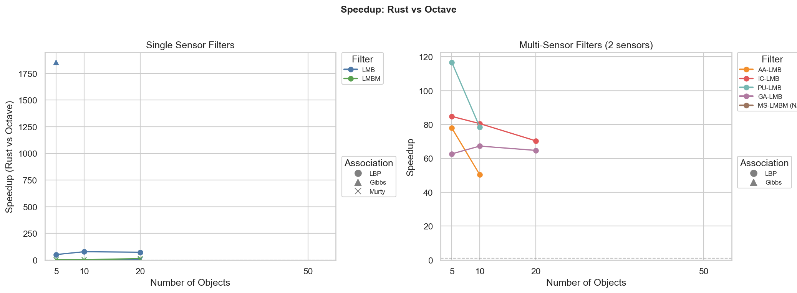
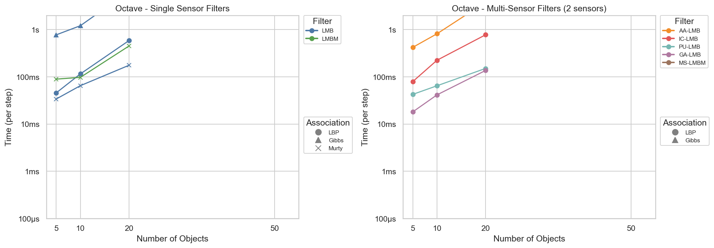
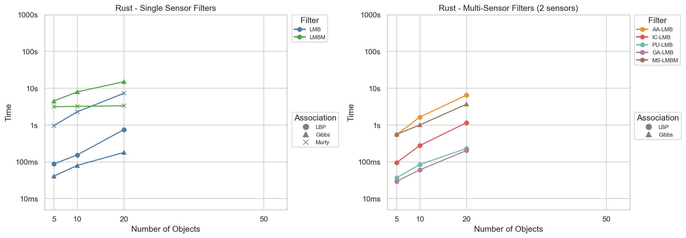
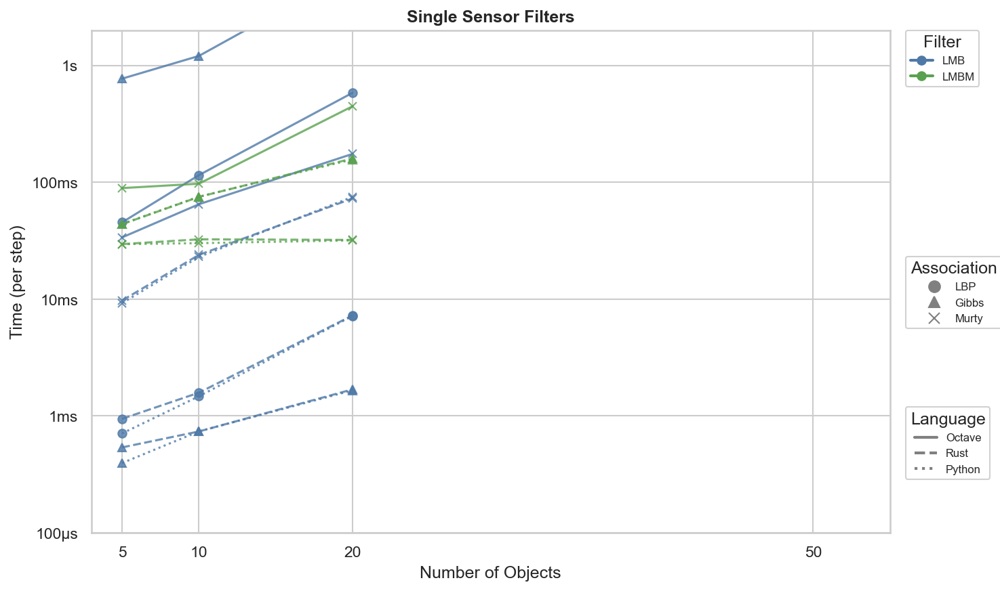
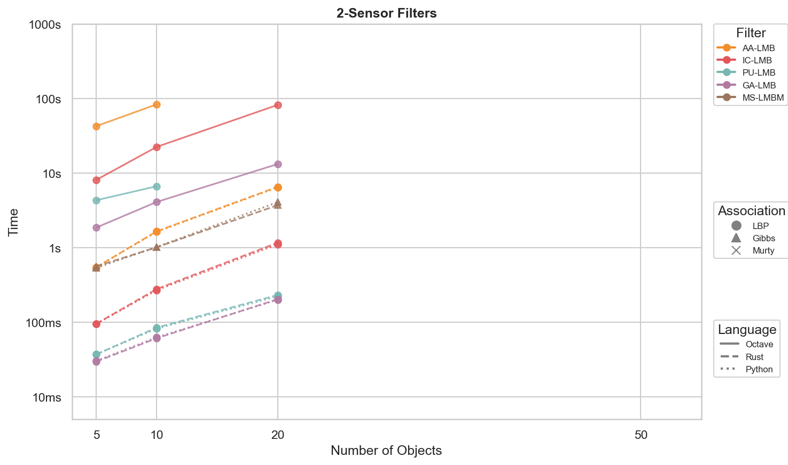
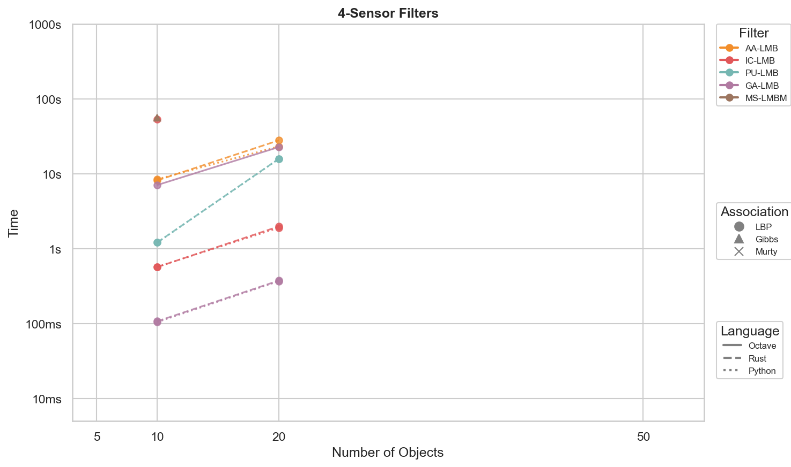

# LMB Filter Benchmark Results

*Generated: 2026-01-07 13:29:55*

## Overview

This benchmark compares implementations of the LMB (Labeled Multi-Bernoulli) filter:

| Implementation | Description |
|----------------|-------------|
| **Octave/MATLAB** | Original reference implementation (interpreted) |
| **Rust** | Native Rust binary compiled with `--release` |
| **Python** | Python calling Rust via PyO3/maturin bindings |

## Performance Summary

### Rust vs Octave Speedup

### Performance by Language

 

### Performance by Sensor Count

| Single | Dual | Quad |
|--------|------|------|
|  |  |  |

## Methodology

- **Timeout**: 120 seconds per scenario
- **Thresholds**: existence=1e-3, gm_weight=1e-4, max_components=100, gm_merge=∞
- **Association**: LBP (100 iterations, tol 1e-6), Gibbs (1000 samples), Murty (25 assignments)
- **RNG Seed**: 42 (deterministic across all implementations)

## Results

### LMB-LBP

| Objects | Sensors | Octave (ms) | Python (ms) | Rust (ms) |
|---------|---------|-------------|-------------|-----------|
| 5 | 1 | 4478.3 | 54.4 (×82.3) | 87.6 (×51.1) |
| 10 | 1 | 11991.0 | 148.6 (×80.7) | 153.9 (×77.9) |
| 20 | 1 | 54818.9 | 740.9 (×74.0) | 749.8 (×73.1) |

### LMB-Gibbs

| Objects | Sensors | Octave (ms) | Python (ms) | Rust (ms) |
|---------|---------|-------------|-------------|-----------|
| 5 | 1 | 75539.4 | 45.6 (×1656.9) | 40.8 (×1853.7) |
| 10 | 1 | TIMEOUT | 75.2 (N/A) | 79.8 (N/A) |
| 20 | 1 | SKIP | 169.0 (N/A) | 179.3 (N/A) |

### LMB-Murty

| Objects | Sensors | Octave (ms) | Python (ms) | Rust (ms) |
|---------|---------|-------------|-------------|-----------|
| 5 | 1 | 3472.4 | 957.5 (×3.6) | 966.0 (×3.6) |
| 10 | 1 | 6737.2 | 2327.8 (×2.9) | 2292.0 (×2.9) |
| 20 | 1 | 16585.3 | 7217.3 (×2.3) | 7288.4 (×2.3) |

### LMBM-Gibbs

| Objects | Sensors | Octave (ms) | Python (ms) | Rust (ms) |
|---------|---------|-------------|-------------|-----------|
| 5 | 1 | TIMEOUT | 4846.4 (N/A) | 4516.3 (N/A) |
| 5 | 2 | SKIP | 4634.7 (N/A) | 4409.6 (N/A) |
| 10 | 1 | SKIP | 8655.5 (N/A) | 7975.5 (N/A) |
| 10 | 2 | SKIP | 7949.5 (N/A) | 8696.4 (N/A) |
| 10 | 4 | SKIP | 8264.2 (N/A) | 8352.0 (N/A) |
| 20 | 1 | SKIP | 20934.7 (N/A) | 15067.5 (N/A) |
| 20 | 2 | SKIP | 15401.5 (N/A) | 15066.9 (N/A) |
| 20 | 4 | SKIP | 14782.3 (N/A) | 16789.0 (N/A) |
| 20 | 8 | SKIP | 15125.0 (N/A) | 19385.7 (N/A) |
| 50 | 8 | SKIP | 35566.8 (N/A) | 34698.0 (N/A) |

### LMBM-Murty

| Objects | Sensors | Octave (ms) | Python (ms) | Rust (ms) |
|---------|---------|-------------|-------------|-----------|
| 5 | 1 | 9258.0 | 3140.4 (×2.9) | 3143.1 (×2.9) |
| 5 | 2 | 26955.9 | 3131.8 (×8.6) | 3230.9 (×8.3) |
| 10 | 1 | 10286.3 | 3216.7 (×3.2) | 3232.1 (×3.2) |
| 10 | 2 | 27821.3 | 3191.2 (×8.7) | 3170.3 (×8.8) |
| 10 | 4 | 22084.7 | 3366.9 (×6.6) | 3292.7 (×6.7) |
| 20 | 1 | 44367.8 | 3518.6 (×12.6) | 3338.0 (×13.3) |
| 20 | 2 | 34274.6 | 3253.6 (×10.5) | 3286.9 (×10.4) |
| 20 | 4 | 37055.7 | 3630.6 (×10.2) | 3602.7 (×10.3) |
| 20 | 8 | 23886.9 | 3358.0 (×7.1) | 3253.0 (×7.3) |
| 50 | 8 | 52480.6 | 3729.9 (×14.1) | 3854.8 (×13.6) |

### AA-LMB-LBP

| Objects | Sensors | Octave (ms) | Python (ms) | Rust (ms) |
|---------|---------|-------------|-------------|-----------|
| 5 | 2 | 42410.7 | 544.4 (×77.9) | 544.0 (×78.0) |
| 10 | 2 | 83106.7 | 1623.4 (×51.2) | 1651.7 (×50.3) |
| 10 | 4 | TIMEOUT | 8431.5 (N/A) | 8139.6 (N/A) |
| 20 | 2 | SKIP | 6410.1 (N/A) | 6519.6 (N/A) |
| 20 | 4 | SKIP | 23168.2 (N/A) | 27859.8 (N/A) |
| 20 | 8 | SKIP | 57079.9 (N/A) | 57696.3 (N/A) |
| 50 | 8 | SKIP | TIMEOUT | TIMEOUT |

### IC-LMB-LBP

| Objects | Sensors | Octave (ms) | Python (ms) | Rust (ms) |
|---------|---------|-------------|-------------|-----------|
| 5 | 2 | 8061.9 | 94.3 (×85.5) | 95.1 (×84.8) |
| 10 | 2 | 22354.2 | 267.5 (×83.6) | 277.5 (×80.5) |
| 10 | 4 | 53179.1 | 571.4 (×93.1) | 567.0 (×93.8) |
| 20 | 2 | 81746.3 | 1104.3 (×74.0) | 1161.6 (×70.4) |
| 20 | 4 | TIMEOUT | 1893.5 (N/A) | 1976.1 (N/A) |
| 20 | 8 | SKIP | 4587.3 (N/A) | 4669.9 (N/A) |
| 50 | 8 | SKIP | 32869.5 (N/A) | 33703.1 (N/A) |

### PU-LMB-LBP

| Objects | Sensors | Octave (ms) | Python (ms) | Rust (ms) |
|---------|---------|-------------|-------------|-----------|
| 5 | 2 | 4304.0 | 37.1 (×116.1) | 36.9 (×116.7) |
| 10 | 2 | 6628.0 | 81.6 (×81.3) | 84.5 (×78.4) |
| 10 | 4 | TIMEOUT | 1203.4 (N/A) | 1210.2 (N/A) |
| 20 | 2 | SKIP | 221.1 (N/A) | 231.0 (N/A) |
| 20 | 4 | SKIP | 15718.4 (N/A) | 15786.4 (N/A) |
| 20 | 8 | SKIP | TIMEOUT | TIMEOUT |
| 50 | 8 | SKIP | SKIP | SKIP |

### GA-LMB-LBP

| Objects | Sensors | Octave (ms) | Python (ms) | Rust (ms) |
|---------|---------|-------------|-------------|-----------|
| 5 | 2 | 1851.2 | 30.3 (×61.1) | 29.5 (×62.7) |
| 10 | 2 | 4083.1 | 62.6 (×65.2) | 60.7 (×67.3) |
| 10 | 4 | 7060.5 | 104.4 (×67.6) | 107.2 (×65.9) |
| 20 | 2 | 13161.7 | 199.1 (×66.1) | 203.4 (×64.7) |
| 20 | 4 | 22660.7 | 366.9 (×61.8) | 374.0 (×60.6) |
| 20 | 8 | 38279.3 | 696.3 (×55.0) | 689.9 (×55.5) |
| 50 | 8 | TIMEOUT | 5968.2 (N/A) | 6062.5 (N/A) |

### MS-LMBM-Gibbs

| Objects | Sensors | Octave (ms) | Python (ms) | Rust (ms) |
|---------|---------|-------------|-------------|-----------|
| 5 | 2 | TIMEOUT | 531.5 (N/A) | 558.8 (N/A) |
| 10 | 2 | SKIP | 1018.9 (N/A) | 1008.6 (N/A) |
| 10 | 4 | SKIP | 56084.3 (N/A) | 55656.9 (N/A) |
| 20 | 2 | SKIP | 4061.9 (N/A) | 3693.9 (N/A) |
| 20 | 4 | SKIP | TIMEOUT | TIMEOUT |
| 20 | 8 | SKIP | SKIP | SKIP |
| 50 | 8 | SKIP | SKIP | SKIP |

## Notes

- **Octave/MATLAB** is interpreted and significantly slower by design
- **Rust** and **Python** run the same compiled Rust code; small differences are PyO3 overhead
- **TIMEOUT** means the benchmark exceeded the time limit
- **ERROR** indicates a runtime error (check logs for details)
- **SKIP** means a previous scenario timed out, so harder scenarios were skipped
- **-** means not applicable (e.g., single-sensor LMB on multi-sensor scenario) or not run

