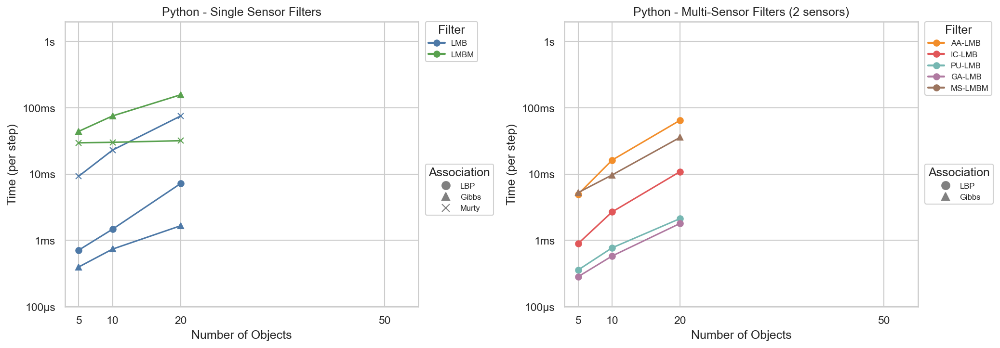

# LMB Filter Benchmark Results

*Generated: 2026-01-07 11:51:15*

## Overview

This benchmark compares implementations of the LMB (Labeled Multi-Bernoulli) filter:

| Implementation | Description |
|----------------|-------------|
| **Octave/MATLAB** | Original reference implementation (interpreted) |
| **Rust** | Native Rust binary compiled with `--release` |
| **Python** | Python calling Rust via PyO3/maturin bindings |

## Performance Summary

### Rust vs Octave Speedup

### Performance by Language

| Octave | Rust | Python |
|--------|------|--------|
|  |  |  |

## Methodology

- **Timeout**: 120 seconds per scenario
- **Thresholds**: existence=1e-3, gm_weight=1e-4, max_components=100, gm_merge=∞
- **Association**: LBP (100 iterations, tol 1e-6), Gibbs (1000 samples), Murty (25 assignments)
- **RNG Seed**: 42 (deterministic across all implementations)

## Results

